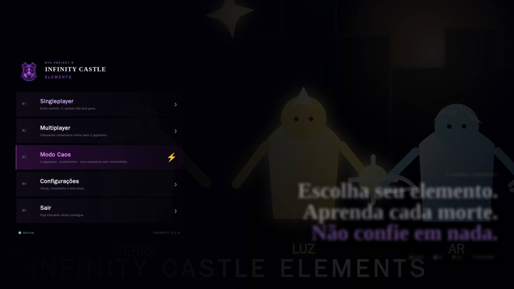
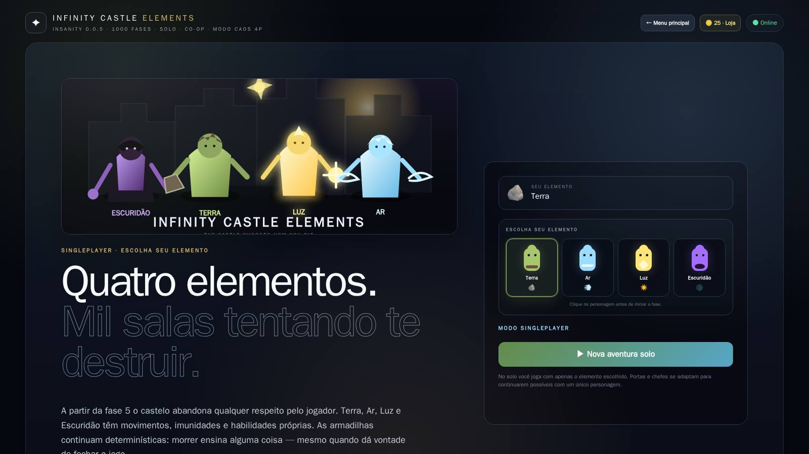
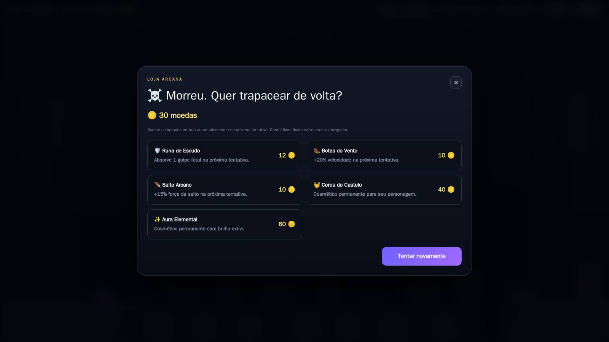
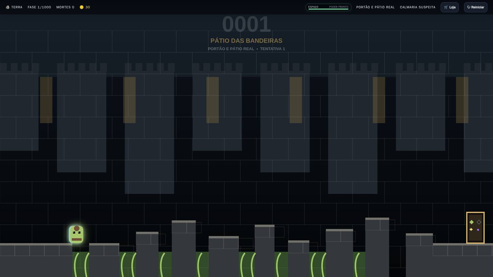
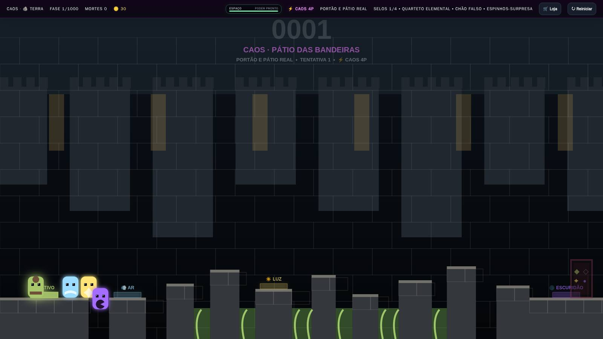

# Infinity Castle Elements — INSANITY 0.0.5

**Infinity Castle Elements** é um jogo original de plataforma troll, ação e sobrevivência da **NYX PROJECT R**, com campanha de **1000 fases**, quatro elementos jogáveis, singleplayer, multiplayer cooperativo, **Modo Caos para 4 jogadores online**, inimigos, chefes, moedas, loja, boosts, cosméticos e uma dificuldade feita para o castelo aprender a odiar você de volta.

A versão **INSANITY 0.0.5** corrige um SyntaxError no processo principal Electron introduzido na 0.0.4 e adiciona validação de sintaxe ao pipeline antes de gerar os executáveis.

**Versão atual do jogo:** `0.0.5`

## 📸 Screenshots

  Veja um pouco do universo de <strong>Infinity Castle Elements</strong>.

 

<table align="center">
  <tr>
    <td align="center">
      
       
      <strong>🏰 Menu Principal</strong>
    </td>
    <td align="center">
      
       
      <strong>🔥 Seleção de Elementos</strong>
    </td>
  </tr>

  <tr>
    <td align="center">
      
       
      <strong>🎮 Singleplayer</strong>
    </td>
    <td align="center">
      
       
      <strong>🌐 Multiplayer Online</strong>
    </td>
  </tr>

  <tr>
    <td align="center">
      
       
      <strong>💀 Modo Caos</strong>
    </td>
    <td align="center">
      
       
      <strong>📱 Versão Android</strong>
    </td>
  </tr>
</table>

 

  Explore o castelo, domine os elementos e sobreviva às armadilhas.

## Novidades da versão 0.0.5

### 🛠️ Hotfix de inicialização

- corrige o erro `SyntaxError: missing ) after argument list` em `desktop/main.cjs`;
- corrige as strings do PowerShell usadas pelo atualizador;
- adiciona `node --check desktop/main.cjs` ao workflow de Windows;
- o GitHub não publica mais um executável se o processo principal Electron tiver erro de sintaxe;
- quem instalou a 0.0.4 e está com o jogo sem abrir deve instalar o **Setup 0.0.5** manualmente uma vez.
- no Multiplayer e no Modo Caos, armadilhas reveladas por um jogador agora são registradas como **estado autoritativo da sala** e replicadas para todos os demais jogadores;
- espinhos surpresa, paredes-armadilha e demais armadilhas sincronizadas permanecem iguais para todos os clientes durante a tentativa;
- a recompensa de morte foi corrigida para **+5 moedas somente para o jogador que morreu**;

### 📱 Versão mobile / Android

- adicionada uma versão **Android 0.0.5** do Infinity Castle Elements;
- o app mobile usa a mesma campanha, Multiplayer e **Modo Caos** da versão desktop;
- Multiplayer e Caos continuam conectados ao mesmo servidor central da **Railway**;
- adicionados **controles touch** para mover para esquerda/direita, pular e ativar o poder elemental;
- o gameplay mobile foi adaptado para **tela cheia em orientação horizontal**;
- a interface passou a exibir a **versão real do jogo**, evitando o texto antigo `0.0.2` aparecer em builds 0.0.5;
- a base Android usa **Capacitor**, permitindo evoluir o jogo mobile sem manter uma campanha separada da versão de PC;
- o APK é gerado automaticamente pelo GitHub Actions e publicado junto ao Release da versão.

## Novidades da versão 0.0.4

### 🔄 Atualizador corrigido

- corrige o loop em que a versão antiga continuava pedindo a mesma atualização;
- o jogo espera o processo antigo encerrar antes de instalar;
- a atualização é aplicada sobre a instalação atual;
- o instalador é executado em modo de atualização silenciosa;
- o jogo valida se a versão nova realmente foi instalada antes de reabrir;
- após concluir, a nova versão é aberta automaticamente;
- o fluxo grava um log local de instalação para facilitar diagnóstico caso algo falhe;
- o workflow de Windows agora usa automaticamente a versão do `package.json`, evitando releases presos em números antigos.

## Novidades da versão 0.0.3

A **INSANITY 0.0.3** mantém o Modo Caos e foca em regras mais claras para as pegadinhas: controles invertidos passam a existir apenas em Fases Coringa e armadilhas acionadas no multiplayer passam a ser compartilhadas pela sala.

### 🃏 Fases Coringa

- controles invertidos não aparecem mais em fases normais;
- a inversão agora é exclusiva das **Fases Coringa**;
- as Fases Coringa aparecem de forma determinística ao longo da campanha e são marcadas na HUD;
- essas salas recebem uma camada visual anômala com olhos acompanhando o jogador, quadros tortos, rasgos de realidade e uma ambientação mais perturbadora;
- **nenhum elemento é imune à inversão** nas Fases Coringa — inclusive a Escuridão;
- chefes continuam fora da rotação de Fases Coringa.

### 🔗 Armadilhas sincronizadas no multiplayer

- espinhos surpresa, espinhos pop-up, chão falso, pontes quebráveis, plataformas que somem, lustres, blocos que caem, paredes-relâmpago, saída móvel e saída falsa agora compartilham o mesmo estado entre os jogadores;
- quando um jogador ativa uma armadilha, os demais recebem o evento pela sala online e enxergam a mesma mudança no cenário;
- o servidor mantém o estado das armadilhas durante a tentativa atual e limpa tudo corretamente quando a fase reinicia;
- a sincronização vale tanto para o multiplayer de 2 jogadores quanto para o **Modo Caos** de 4 jogadores: quando um jogador ativa espinhos ou outra armadilha compartilhada, todos na sala enxergam a ativação.

### ⚡ Modo Caos — 4 jogadores

- nova campanha online para **4 jogadores**;
- a sala exige **Terra, Ar, Luz e Escuridão** ao mesmo tempo;
- elementos não podem ser repetidos dentro da sala Caos;
- a partida só começa quando os **4/4 jogadores** estiverem presentes e prontos;
- cada fase normal possui **quatro selos elementais**;
- cada personagem ativa somente o selo correspondente ao próprio elemento;
- a saída permanece bloqueada até os **4 selos** terem sido ativados;
- chefes do Modo Caos usam **quatro runas simultâneas**, uma para cada elemento;
- uma morte reinicia a tentativa para o quarteto inteiro;
- fases do Caos recebem pressão extra de inimigos;
- sincronização visual e de estado ampliada para até **4 personagens**;
- campanha Caos com **save próprio**, separado do singleplayer e do multiplayer de 2 jogadores;
- opção **Continuar Caos — fase X**, criando uma nova sala online a partir do progresso salvo.

### 🌐 Multiplayer online

- servidor multiplayer central hospedado na **Railway**;
- salas privadas por código funcionando entre computadores diferentes pela internet;
- o jogador não precisa abrir servidor, terminal, Node.js ou deixar um PC atuando como host;
- campanha multiplayer de 2 jogadores continua disponível separadamente do Modo Caos;
- saves persistentes para singleplayer, multiplayer e campanha Caos.

### ⬇ Atualizações pelo próprio jogo

- verificação automática de novas versões pelo **GitHub Releases**;
- aviso de atualização disponível no menu principal;
- opção **Verificar atualizações** em Configurações;
- tela com versão instalada, versão nova e notas da atualização;
- download com progresso dentro do jogo na versão Setup;
- opção **Reiniciar e instalar** após o download;
- saves permanecem preservados durante atualizações;
- correção do fluxo do atualizador para evitar travamento/loop ao abrir a janela de atualização.

### 🎮 Controles revisados

- movimento em **A / D** ou **← / →**;
- pulo em **W** ou **↑**;
- **Espaço** ativa a habilidade elemental;
- **E** não ativa mais a habilidade;
- **R**, **ESC** e **F11** permanecem sem alteração.

### ✨ Habilidades elementais — novo pacote visual e de combate

As quatro habilidades agora possuem animação própria, janela ativa e cooldown visível na HUD. O objetivo é fazer cada elemento parecer realmente diferente sem transformar o jogo em spam de poder.

- o **cooldown é de 5 segundos depois que o efeito termina**;
- a HUD mostra **PODER PRONTO**, tempo ativo e tempo restante de recarga;
- **Luz — Coroa Solar:** aura em formato de pequeno sol ao redor da personagem, dura **2,8s**, alcança inimigos próximos em pulsos e pode derrotar no máximo **3 inimigos por ativação**;
- **Escuridão — Fogo Negro:** chamas negras/roxas emanam do personagem por **2,6s**, atacando inimigos próximos; pode derrotar no máximo **2 inimigos por ativação** e mantém apenas uma curta janela inicial de fase/proteção;
- **Terra — Raízes do Abismo:** raízes brotam do chão e procuram inimigos próximos por **1,9s**, alcançando até **2 alvos por ativação**;
- **Ar — Mini Furacão:** um pequeno tornado é lançado na direção em que o jogador está olhando por **2,2s**, podendo atingir no máximo **2 inimigos por ativação**;
- o Ar continua recebendo mobilidade adicional enquanto sua habilidade está ativa;
- Luz e Escuridão não ficam invulneráveis durante toda a duração do poder: existe apenas uma pequena proteção inicial para evitar que a ativação vire morte instantânea;
- o sistema foi deliberadamente limitado por alcance, duração, quantidade de alvos e recarga para preservar a dificuldade **INSANITY**.

### 💾 Outros ajustes mantidos

- botão **Voltar ao menu inicial** dentro da sala multiplayer;
- **+5 moedas apenas para o jogador que morreu** em qualquer modo; no Multiplayer e no Modo Caos, a morte ainda reinicia a tentativa compartilhada, mas a recompensa pertence somente a quem morreu;
- sistema persistente de saves no desktop;
- menu principal com **Singleplayer, Multiplayer, Modo Caos, Configurações e Sair**.

## Downloads para Windows

1. **Instalador:** [Infinity-Castle-Elements-Setup-0.0.5.exe](https://github.com/NyxPjct/Infinity-Castle-Elements/releases/download/v0.0.5/Infinity-Castle-Elements-Setup-0.0.5.exe)
2. **Portable:** [Infinity-Castle-Elements-Portable-0.0.5.exe](https://github.com/NyxPjct/Infinity-Castle-Elements/releases/download/v0.0.5/Infinity-Castle-Elements-Portable-0.0.5.exe)
3. **Pacote com os dois:** [Infinity-Castle-Elements-Windows-0.0.5.zip](https://github.com/NyxPjct/Infinity-Castle-Elements/releases/download/v0.0.5/Infinity-Castle-Elements-Windows-0.0.5.zip)

## Download para Android

1. **APK Android:** [Infinity-Castle-Elements-Android-0.0.5.apk](https://github.com/NyxPjct/Infinity-Castle-Elements/releases/download/v0.0.5/Infinity-Castle-Elements-Android-0.0.5.apk)

> Recomenda-se jogar no celular em **orientação horizontal** para aproveitar o canvas completo e os controles touch.

---

## Abertura e identidade

Ao iniciar o jogo, a apresentação acontece em três etapas:

1. tela preta da **NYX PROJECT R**, com a coruja roxa de olhos vermelhos e a assinatura **Apresenta:**;
2. tela cinematográfica de **INFINITY CASTLE ELEMENTS — INSANITY**, com os quatro elementos diante do castelo em clima de aventura fantástica;
3. menu principal com **Singleplayer, Multiplayer, Modo Caos, Configurações e Sair**. A Loja Arcana continua disponível dentro do jogo.

Na versão desktop, **Sair** fecha o jogo diretamente.

## Campanha com 1000 fases

A campanha vai da fase **1 até a 1000**. A partir da **fase 5**, a dificuldade INSANITY começa a escalar de verdade. As pegadinhas são determinísticas: a ideia é morrer, aprender o que aconteceu e tentar superar o castelo na próxima tentativa.

O jogo possui **12 arquétipos de layout**, **10 regiões** e um chefe a cada 100 fases, totalizando **10 chefes**.

### Regiões

- **001–100 — Portão e Pátio Real**
- **101–200 — Galeria Nobre**
- **201–300 — Masmorras Profundas**
- **301–400 — Torre do Relógio**
- **401–500 — Biblioteca Viva**
- **501–600 — Capela Assombrada**
- **601–700 — Jardins Suspensos**
- **701–800 — Muralhas da Tempestade**
- **801–900 — Trono Rubro**
- **901–1000 — Coração Impossível**

## Elementos jogáveis

### 🪨 Terra
Mais pesado e controlado, resistente a raízes e equipado com **Raízes do Abismo**. Ao pressionar **Espaço**, raízes brotam do chão em direção aos inimigos próximos. A habilidade dura **1,9s**, pode atingir até **2 alvos** e entra em recarga por **5s após terminar**.

### 💨 Ar
Mais rápido e móvel, imune a vendavais e equipado com **Mini Furacão**. Ao pressionar **Espaço**, um pequeno tornado avança na direção em que o personagem está olhando enquanto a mobilidade aérea aumenta temporariamente. O efeito dura **2,2s**, pode atingir até **2 inimigos** e recarrega por **5s após terminar**.

### ☀️ Luz
Resistente a maldições e equipada com **Coroa Solar**. Ao pressionar **Espaço**, uma aura solar pulsante envolve a personagem e ataca inimigos próximos. O efeito dura **2,8s**, pode derrotar até **3 inimigos** e possui **5s de recarga depois que termina**. A proteção defensiva existe somente por um instante no começo da ativação.

### 🌑 Escuridão
Ignora zonas de controles invertidos e usa **Fogo Negro**. Ao pressionar **Espaço**, chamas negras e roxas emanam do corpo e atacam inimigos próximos por **2,6s**. A habilidade pode derrotar até **2 inimigos** por uso e concede somente uma curta janela inicial de fase/proteção, seguida de **5s de recarga após o efeito terminar**.

## Singleplayer

No modo solo, o jogador escolhe **um único elemento** antes de começar. Portões, placas e rituais de chefes são adaptados para que a campanha continue possível com apenas um personagem.

A escolha do elemento agora é feita diretamente pelos **quatro bonequinhos elementais** na tela antes de iniciar a fase, sem precisar descer a interface para procurar a seleção.

O progresso solo inclui fase atual, mortes, elemento, moedas, boosts e cosméticos.

## Multiplayer

O multiplayer foi criado para **2 jogadores**, com salas privadas por código e escolha independente de elemento. O sistema sincroniza jogadores, fase, mortes, chefes, runas, inimigos derrotados e reinícios.

Na edição desktop **0.0.3**, o multiplayer utiliza o servidor online do projeto hospedado na **Railway**. Jogadores em computadores diferentes podem criar e entrar em salas pela internet usando o código da sala, sem precisar iniciar servidor manualmente.

## Modo Caos — 4 jogadores

O **Modo Caos** é uma campanha online paralela para exatamente **4 jogadores**. A sala só começa quando os quatro participantes estiverem presentes e prontos.

Cada sala deve conter os quatro elementos, sem repetição:

- 🪨 **Terra**
- 💨 **Ar**
- ☀️ **Luz**
- 🌑 **Escuridão**

Nas fases normais, quatro **selos elementais** são distribuídos pelo cenário. Cada jogador só ativa o selo do próprio elemento. A saída permanece bloqueada até os quatro selos serem despertados.

Nos chefes, o ritual cooperativo é ampliado para **quatro runas simultâneas**, uma para cada elemento. Os quatro jogadores precisam ocupar suas runas ao mesmo tempo e sobreviver ao ritual.

O Modo Caos também aumenta a presença de inimigos e transforma uma morte em falha coletiva: se um integrante morrer, a tentativa é reiniciada para todo o quarteto.

A campanha Caos possui save separado e pode ser retomada criando uma nova sala a partir da fase salva.

## Sistema de moedas e Loja Arcana

Moedas são recebidas ao concluir fases, derrotar inimigos e também ao morrer. Em **qualquer modo**, cada morte rende **+5 moedas somente ao jogador que morreu**. No Multiplayer e no Modo Caos, os demais jogadores não recebem moedas pela morte de outra pessoa. Elas podem ser usadas na **Loja Arcana** para comprar:

- **Runa de Escudo** — absorve um golpe fatal;
- **Botas do Vento** — aumenta temporariamente a velocidade;
- **Salto Arcano** — aumenta temporariamente a força do salto;
- **Coroa do Castelo** — cosmético permanente;
- **Aura Elemental** — cosmético permanente.

## Inimigos e ameaças

A campanha possui sentinelas, morcegos, espectros e ameaças especiais como armaduras vivas, fantasmas, dragões, projéteis e objetos que despencam do cenário.

A quantidade e a combinação de ameaças aumentam conforme o jogador avança.

## Pegadinhas INSANITY

Entre as mecânicas atuais estão:

- chão falso;
- plataformas que desaparecem;
- pontes quebráveis;
- espinhos normais e surpresa;
- espinhos de teto;
- saídas falsas;
- saída que foge;
- portas falsas;
- blocos e lustres caindo;
- paredes que avançam de surpresa;
- esmagadores;
- elevadores;
- estantes móveis;
- controles invertidos **somente em Fases Coringa**;
- rajadas de vento;
- fantasmas;
- armaduras vivas;
- dragões;
- projéteis;
- combinações de várias pegadinhas na mesma sala.

## Chefes

Há chefes nas fases **100, 200, 300, 400, 500, 600, 700, 800, 900 e 1000**.

Eles utilizam barreiras, runas, rituais, projéteis e arenas próprias, com comportamento adaptado para singleplayer e multiplayer.

## Sistema anti-fase-impossível

O gerador protege áreas críticas como spawn, saída, placas, portões, runas e caminhos obrigatórios.

Também existe uma **sala de emergência**: se uma geração for detectada como estruturalmente inválida, aquela fase é substituída por um layout seguro em vez de deixar a partida quebrada.

## Auditoria das 1000 fases

A build possui auditoria própria para geração, renderização, estruturas críticas, inimigos e runtime dos quatro elementos.

Na INSANITY 0.0.3, o processo de validação verifica:

- **1000 fases**;
- **10 chefes**;
- **240 fases com portões**;
- **12 arquétipos**;
- **10 regiões**;
- renderização das fases;
- runtime dos quatro elementos;
- áreas críticas de spawn e saída.

## Configurações e menu de pausa

A versão desktop inicia **em tela cheia por padrão**.

Dentro de **Configurações** ficam centralizadas as opções de:

- **resolução** — Nativa, 4K, 1440p, 1080p, 1600×900, 1366×768 e 720p;
- **idioma da interface** — Português, Inglês, Espanhol, Francês, Alemão, Italiano, Holandês, Polonês, Russo, Turco, Japonês, Coreano, Chinês Simplificado, Chinês Tradicional, Árabe, Hindi, Sueco, Dinamarquês, Finlandês e Tcheco;
- **tela cheia**;
- **tremor de tela**;
- **redução de animações**.

Durante uma fase, pressione **ESC** para abrir o menu de pausa. Nele é possível:

- **Salvar jogo**;
- abrir **Configurações**;
- **Sair para o menu**;
- **Sair para desktop**.

Pressionar **ESC novamente** fecha o menu de pausa e continua a tentativa.

## Controles

- **A / D** ou **← / →** — movimento
- **W** ou **↑** — pular
- **Espaço** — habilidade elemental
- **R** — reiniciar fase
- **ESC** — abrir/fechar menu de pausa
- **F11** — alternar tela cheia

> Na **0.0.3**, a habilidade elemental saiu do **E** e passou para o **Espaço**. O pulo pode ser feito com **W** ou **↑**.

---

# Especificações de execução

## Versão oficial

A versão oficial é distribuída para **Windows 64 bits** em três opções:

- **Setup** — instalador tradicional do Windows;
- **Portable** — executável que abre diretamente, sem instalação;
- **Pacote ZIP** — contém o Setup e o Portable juntos.

O jogo já inclui os componentes necessários para funcionar. **O jogador não precisa instalar Node.js, npm, Express ou Socket.IO separadamente.**

## Requisitos recomendados

- **Windows 10 ou Windows 11 — 64 bits**
- processador **x64**
- **4 GB de RAM** ou mais
- aceleração gráfica compatível
- espaço livre para o jogo e os dados locais de save
- conexão com a internet somente para os recursos multiplayer online

## Tecnologias utilizadas

O jogo utiliza internamente:

- **Electron**
- **Node.js**
- **JavaScript**
- **HTML5**
- **CSS**
- **Canvas 2D**
- **Express**
- **Socket.IO**

Essas tecnologias fazem parte do aplicativo e não precisam ser instaladas manualmente pelo jogador.

## Instalação

### Instalador
Baixe:

**Infinity-Castle-Elements-Setup-0.0.5.exe**

Abra o arquivo, escolha a pasta de instalação e conclua o assistente. O instalador pode criar atalhos na Área de Trabalho e no Menu Iniciar.

### Portable
Baixe:

**Infinity-Castle-Elements-Portable-0.0.5.exe**

Abra o executável diretamente. Não é necessário instalar o jogo.

### Pacote completo
Baixe:

**Infinity-Castle-Elements-Windows-0.0.5.zip**

Extraia o arquivo para encontrar as versões Setup e Portable.

## Windows SmartScreen

A versão 0.0 ainda não utiliza certificado comercial de assinatura de código. Por isso, dependendo das configurações do Windows, o SmartScreen pode exibir um aviso de **editor desconhecido** ao abrir o executável pela primeira vez.

---

# INSANITY 0.0.6 — The Castle Remembers

A versão **0.0.6** expande o Infinity Castle Elements com novos sistemas de horror, progressão, desafio e comportamento dinâmico do castelo, mantendo os modos **Singleplayer**, **Multiplayer** e **Caos 4P**.

## Fases Coringa evoluídas

As **Fases Coringa** continuam aparecendo exclusivamente em fases especiais e agora podem combinar entre **1 e 3 maldições** diferentes.

Entre as regras proibidas disponíveis estão:

- **controles invertidos**;
- **apagões**;
- **gravidade pesada**;
- **gravidade instável/leve**;
- **mundo espelhado**;
- **paredes se fechando**;
- **Eco**, um clone atrasado do próprio jogador.

A inversão de controles continua sendo exclusiva das Fases Coringa e **não aparece em fases normais**.

## Castelo adaptativo

A partir de várias tentativas na mesma sala, o castelo pode adaptar parte das armadilhas ao comportamento do jogador.

O sistema pode adicionar novas ameaças em rotas utilizadas repetidamente, dando a sensação de que o castelo está observando e aprendendo como cada jogador tenta atravessar a fase.

No multiplayer, essas armadilhas continuam utilizando o sistema compartilhado de eventos da sala para manter a experiência sincronizada entre os jogadores.

## Falas do Castelo

O castelo agora possui comentários contextuais durante a partida.

As falas podem reagir a situações como:

- mortes repetidas;
- múltiplas tentativas na mesma fase;
- entrada em salas especiais;
- presença do Perseguidor;
- anomalias;
- acontecimentos únicos da fase 666.

O objetivo é reforçar a sensação de que o próprio castelo observa o jogador.

## Anomalias raras

Algumas salas podem receber eventos visuais e comportamentais raros, entre eles:

- figuras observando ao fundo;
- olhos escondidos no cenário;
- numeração incorreta da sala;
- silêncio e escurecimento anormal;
- portas que aparecem e desaparecem.

Essas ocorrências são raras e não fazem parte da estrutura normal de todas as fases.

## O Perseguidor

Uma entidade recorrente pode começar aparecendo apenas como uma presença distante no cenário.

Em fases mais avançadas, determinadas salas podem transformar essa presença em uma ameaça real, fazendo a criatura sair do fundo e perseguir o jogador.

Sobreviver a uma dessas salas também pode liberar uma conquista específica.

## Chefes elementais

Os guardiões agora podem possuir afinidades elementais.

Os padrões de ataque variam conforme o elemento do chefe:

- **Terra**;
- **Ar**;
- **Luz**;
- **Escuridão**.

Isso adiciona comportamento próprio aos encontros de chefe sem remover o sistema de runas e rituais já existente.

## Fases de perseguição

Algumas fases especiais ativam uma parede de corrupção que avança pelo cenário.

O jogador precisa continuar se movendo e alcançar a saída antes que a área tomada pelo castelo o alcance.

## Salas secretas

Determinadas fases podem esconder entradas especiais.

Encontrar uma sala secreta pode conceder:

- moedas;
- fragmentos de lore;
- relíquias;
- conquistas.

Essas salas fazem parte do novo sistema de exploração da 0.0.6.

## Relíquias

A versão 0.0.6 introduz relíquias colecionáveis.

Atualmente existem:

- **🫀 Coração Trincado** — pode impedir uma morte por fase;
- **🪽 Passo do Vendaval** — aumenta velocidade e aceleração;
- **🪶 Pena do Abismo** — aumenta a força do salto;
- **⌛ Vidro Cronal** — reduz a recarga da habilidade elemental;
- **👁️ Olho da Avareza** — aumenta as moedas recebidas;
- **◉ Marca do Vidente** — facilita a percepção de salas secretas e anomalias.

Apenas **uma relíquia pode permanecer ativa por vez**.

## Ranking de sofrimento

Ao concluir fases, o jogo agora pode avaliar o desempenho considerando fatores como:

- tempo;
- mortes;
- quantidade de tentativas;
- dificuldade especial da sala.

Os ranks possíveis são:

**S · A · B · C · D · CASTELO TE ODEIA**

## Conquistas

A 0.0.6 adiciona um sistema de conquistas locais ligado a acontecimentos da campanha.

Entre os desafios estão:

- morrer pela primeira vez;
- alcançar grandes quantidades de mortes;
- concluir uma Coringa sem morrer;
- encontrar uma sala secreta;
- derrotar um guardião;
- entrar na fase 666;
- sobreviver ao Perseguidor;
- superar uma sala no Modo Caos;
- chegar ao fim das 1000 fases.

## Fase 666

A **fase 666** agora possui tratamento próprio e não utiliza o layout procedural normal.

Ela inclui:

- cenário especial;
- HUD completamente oculto;
- atmosfera diferenciada;
- olhos no cenário;
- entidade observando ao fundo;
- mensagens exclusivas;
- conquista própria.

A fase continua fazendo parte da progressão normal até a sala 1000.

## Replay de morte

Quando possível, o jogo guarda os últimos instantes de movimento do personagem e mostra um pequeno replay visual após a morte.

O efeito destaca a rota utilizada imediatamente antes da armadilha atingir o jogador.

## Crônicas do Castelo

O menu principal ganhou a seção **Crônicas do Castelo**.

Nela podem ser consultados:

- conquistas;
- relíquias encontradas;
- relíquia atualmente equipada;
- fragmentos de lore;
- estatísticas gerais;
- melhor rank alcançado.

## Finais alternativos

A conclusão das 1000 fases agora pode variar conforme o histórico da campanha.

Existem diferentes resultados, incluindo:

- **Final — A Porta do Infinito**;
- **Final Verdadeiro — O Castelo Lembra**;
- **Final Amaldiçoado — Você Virou Parte Dele**.

As condições levam em consideração fatores da progressão, descobertas e desempenho acumulado.

## Multiplayer e Modo Caos

Os novos sistemas foram integrados sem remover o funcionamento existente do multiplayer.

A versão 0.0.6 mantém:

- Multiplayer de 2 jogadores;
- Modo Caos de 4 jogadores;
- morte compartilhada;
- armadilhas sincronizadas;
- portões cooperativos;
- selos elementais;
- runas dos chefes;
- habilidades dos quatro elementos.

## Validação da 0.0.6

Antes da publicação, a versão final passou pelo pipeline oficial do projeto com:

- **checagem de sintaxe JavaScript**;
- **auditoria das 1000 fases**;
- **teste de runtime dos quatro elementos**;
- **validação estrutural das fases**;
- **teste do Multiplayer / Modo Caos com 4 jogadores**;
- **build Windows**;
- **build Android**.

A versão publicada corresponde à **Infinity Castle Elements — INSANITY 0.0.6**.
